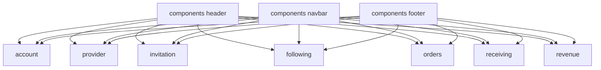

拆分與重構規劃：default.html 分頁外部化與 Header 調整

範圍
- 僅規劃文件，無程式碼變更；實作將另行進行。
- 基於 [default.html](default.html:221) 結構與腳本 [html.script()](default.html:3148) 進行拆分。

1. 七大分頁外部化規劃

1.1 新頁面與來源區塊對應
- account.html ← [#account-data-section](default.html:1015)
- provider-application.html ← [#provider-application-section](default.html:1256)
- invitation.html ← [#invitation-section](default.html:1057)
- following.html ← [#following-section](default.html:1102)
- orders.html ← [#orders-section](default.html:1145)
- receiving.html ← [#receiving-section](default.html:1666)
- revenue.html ← [#revenue-section](default.html:1776)

1.2 每頁內容與提取方式
- account.html
  - 內容：帳戶資料表單區塊 [html.div()](default.html:1015-1055) 與頁尾儲存按鈕 [#account-save-button](default.html:1781-1786)。
  - 腳本：無需分頁切換；僅保留與表單互動相關之邏輯（目前無專屬邏輯）。
- provider-application.html
  - 內容：服務商申請整段 [html.div()](default.html:1257-1665) 含審核狀態、基本資料、詳細資料、興趣/專長互動與儲存/送審提示。
  - 腳本：保留興趣/專長點擊互動。對應腳本來源：
    - 興趣多選 [html.script()](default.html:3336-3344,3495-3500)
    - 專長互動（含多選群組與單選群組）[html.script()](default.html:3346-3369,3502-3513)
- invitation.html
  - 內容：邀請分頁主體 [html.div()](default.html:1058-1100) 與加入會員彈窗 [#join-member-modal](default.html:3438-3467)。
  - 腳本：彈窗開關與複製連結 [html.script()](default.html:3470-3494,3481-3486)。
- following.html
  - 內容：關注卡片清單 [html.div()](default.html:1103-1143)。
  - 腳本：產品詳情 Drawer 觸發沿用 KTUI（無自定義 JS 必要）。
- orders.html
  - 內容：訂單狀態分頁與列表 [html.div()](default.html:1146-1254)。
  - 腳本：訂單狀態切換 [html.script()](default.html:3373-3395)。
- receiving.html
  - 內容：接單狀態分頁與列表 [html.div()](default.html:1667-1774)。
  - 腳本：接單狀態切換 [html.script()](default.html:3398-3420)。
- revenue.html
  - 內容：收益主體 [html.div()](default.html:1777-1778)（目前為佔位，後續擴充）。
  - 腳本：無。

1.3 頁面共同佈局一致性
- 共同導入 Header、Navbar、Footer 與全域資源：
  - Header： [html.header()](default.html:223-734)
  - Navbar（mega menu）：[html.div()](default.html:736-878)
  - Footer： [html.footer()](default.html:1791-1818)
  - 全域樣式/腳本： [html.link()](default.html:39-42), [html.script()](default.html:3139-3146)
- 每個分頁改以真實跳頁導覽（非單頁顯示/隱藏）：
  - 導覽籤改為超連結指向對應檔，如帳戶資料指向 account.html 等。
  - 以「活頁樣式」呈現：在各新頁面中，為對應導覽籤加上 here/active 樣式（於共用 JS 自動標示）。

1.4 由 default.html 抽取的腳本拆分原則
- 僅保留各頁必要腳本，移除原分頁切換顯示/隱藏邏輯：
  - 原分頁主切換 [html.script()](default.html:3148-3300) 將移除，改以多頁面路由。
- 抽出為專屬檔案至 assets/js/pages/：
  - account.js、provider-application.js、invitation.js、following.js、orders.js、receiving.js、revenue.js
- 共用初始化至 assets/js/layout.js：
  - KTUI 初始化、主選單當前項標示、Theme 切換維持、Drawer/Modal 通用行為。

2. Header 修改：Wishlist 改跳轉邀請頁

現況
- 心形按鈕位於 Topbar，使用 Drawer 觸發：
  - 按鈕： [html.button()](default.html:343-346) data-kt-drawer-toggle="#drawers_shop_wishlist"
  - Drawer 內容： [html.div()](default.html:348-546) id="drawers_shop_wishlist"

修改方案
- 將按鈕改為導向 invitation.html，移除 Drawer 觸發屬性：
  - 將 [html.button()](default.html:343) 移除 data-kt-drawer-toggle，並改為 [html.a()](default.html:343) 或加上 onclick 導頁。
  - 建議最終形式： <a class="...同樣樣式..." href="invitation.html"><i class="ki-filled ki-heart"></i></a>
  - 若維持按鈕：加上 onclick="location.href='invitation.html'"。
- Drawer 區塊處理：
  - 可保留原標記（不再被觸發）或於最終版本移除 [html.div()](default.html:348-546) 以減少 DOM。
- 其他 Header 功能不變：使用者下拉、通知、產品詳情 Drawer 等維持。

3. 共用 Header 機制與交接考量

3.1 拆出共用檔
- 建議建立 components/ 目錄：
  - components/header.html ← 來源 [html.header()](default.html:223-734)
  - components/navbar.html ← 來源 [html.div()](default.html:736-878)
  - components/footer.html ← 來源 [html.footer()](default.html:1791-1818)

3.2 在各頁引用方式
- HTML 靜態專案（過渡期）：
  - 以輕量 include 腳本載入：
    - 在各頁 

，以 fetch('components/header.html') 注入。
    - 同理載入 navbar.html、footer.html。
- PHP 上線後（建議最終）：
  - 在各頁開頭： <?php include 'components/header.php'; ?>
  - 亦可改 .html 為 .php 檔名，使用 include_once 以避免重複載入。

3.3 預留 PHP 動態區塊
- 使用者資訊（暱稱、會員編號、角色）：
  - 來源區塊 [html.div()](default.html:249-265)；以 PHP 注入使用者資料。
- 登入/登出連結與權限顯示：
  - [html.a()](default.html:335-337) 與個人資料/服務商申請/邀請等選單的可見性由 PHP 控制。
- 主題切換狀態：
  - 仍以 localStorage 保存；PHP 僅需輸出初始 data-kt-theme-mode（可依使用者偏好）。

4. 拆分後的專案結構建議

根目錄
- account.html
- provider-application.html
- invitation.html
- following.html
- orders.html
- receiving.html
- revenue.html
- default.html（保留為聚合頁參考，可標註 deprecated）
- components/
  - header.html
  - navbar.html
  - footer.html
- assets/
  - css/ styles.css（既有）
  - js/
    - core.bundle.js（既有）
    - widgets/general.js（既有）
    - layout.js（新，放共用初始化）
    - pages/
      - account.js
      - provider-application.js
      - invitation.js
      - following.js
      - orders.js
      - receiving.js
      - revenue.js

5. 腳本統一管理要點
- 在 components/header.html 末尾或各頁底部統一載入：
  - 
  - 
  - 
  - 頁面專屬：如 orders.html 載入 assets/js/pages/orders.js
- layout.js 職責：
  - 依據當前 URL 自動為 Navbar/分頁項加上 active/here 樣式。
  - 初始化 KTDrawer、KTDropdown、Theme 切換。
  - 維持與 default.html 相同的樣式/行為一致性。

6. 導覽一致性策略
- Navbar 既有連結維持：首頁 [html.a()](default.html:742-747)、快速配對 [html.a()](default.html:749-753) 等不變。
- 會員中心內部分頁改以真實頁面連結：
  - 在 components/navbar.html 或頁內二級導覽中，改為 href 指向對應 *.html。
- 若需保留 URL 參數預選分頁（如 ?tab=following），在多頁改為直接導向對應檔案，不再解析參數。

7. 實施步驟（實作指引）
- 建立 components/* 並從 [default.html](default.html:223) 抽取 Header、Navbar、Footer。
- 建立七個分頁檔，貼上對應內容區塊與需要的互動腳本。
- 建立 assets/js/layout.js 與各頁 pages/*.js，從 [html.script()](default.html:3148-3434,3470-3513) 拆出必要段落。
- 修改 Header 心形按鈕為導向 invitation.html；保留或移除 Wishlist Drawer。
- 逐頁驗證樣式與互動與原本一致（KTUI、按鈕、Badge 樣式）。

8. Mermaid 簡圖（頁面與共用組件）

9. 維護性與交接重點
- 單一職責：每頁只含自身內容與互動，通用行為進入 layout.js。
- 儘量避免重複：Header/Navbar/Footer 單一來源檔。
- 為 PHP 預留：動態資料以 PHP include 與樣板變數注入。
- 文件化：於專案根新增 README-structure.md 簡述引入方式與頁面對應。

完成定義（DoD）
- 新增七個分頁檔與三個共用組件檔規劃清楚（檔名、來源對應與腳本清單）。
- Header 心形按鈕改跳轉邀請頁規劃明確（屬性調整點位與替代寫法）。
- 架構圖與目錄結構提供，利於 PHP 團隊接手。